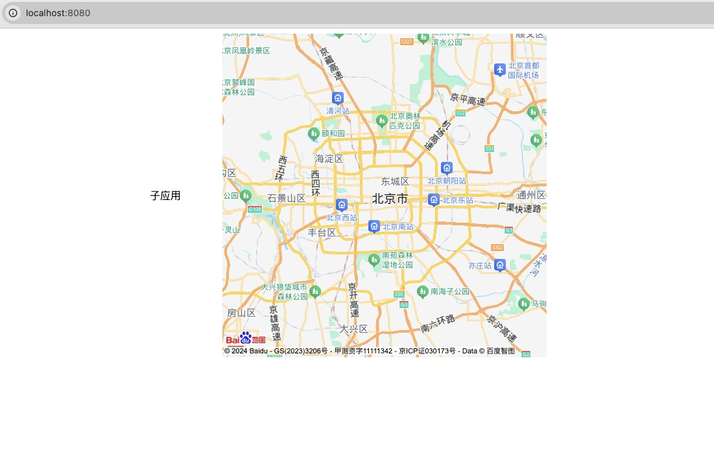

# iframe 模式下子应用使用 百度地图

### 启动
1. 基座: `main`文件夹， `pnpm/npm run dev`/ `yarn dev`
1. 基座: `vite-demo`文件夹， `pnpm/npm run dev`/ `yarn dev`

### 解决方案
1. iframe 模式
    ```jsx
    <micro-app
          class="{styles.app}"
          iframe
          name="app"
          url="http://localhost:6616/"
          router-mode="pure"
        ></micro-app>
    ```
1. 使用 @micro-zoe/micro-plugin-map
    ```js
    import { createApp } from 'vue'
    import App from './App.vue'
    // 地图插件
    import microPluginMap from '@micro-zoe/micro-plugin-map'
    import microApp from '@micro-zoe/micro-app'

    createApp(App).mount('#app')


    microApp.start({
      plugins: {
        modules: {
          'app': [microPluginMap]
        }
      }
    })
    ```
1. 在基座添加百度地图的SDK JS
    ```html
    <!doctype html>
    <html lang="en">
      <head>
        <!-- ... -->
        <script exclude type="text/javascript" src="//api.map.baidu.com/api?type=webgl&v=1.0&ak=M2h5aPwN9fDFpeNWXLcabV1tQorXVUo6"></script>
        <!-- ... -->
      </head>
      <!-- ... -->
    </html>
    ```
1. 在子应用中添加 兼容基座百度全局变量的代码（当然也有其他的方式，能将基座的BMapGL传递给子应用即可）
    ```html
    <!-- 简易demo -->
    <script type="text/javascript">
        // GL版命名空间为BMapGL
        // 按住鼠标右键，修改倾斜角和角度
        let BMapGL = window.BMapGL
        if (window.rawWindow) {
            BMapGL = window.rawWindow.BMapGL
        }
        var map = new BMapGL.Map("allmap");    // 创建Map实例
        map.centerAndZoom(new BMapGL.Point(116.404, 39.915), 11);  // 初始化地图,设置中心点坐标和地图级别
        map.enableScrollWheelZoom(true);     //开启鼠标滚轮缩放

    </script>
    ```

1. 📢📢📢📢📢📢注意：demo中的百度地图sdk记得替换

### 基座效果



