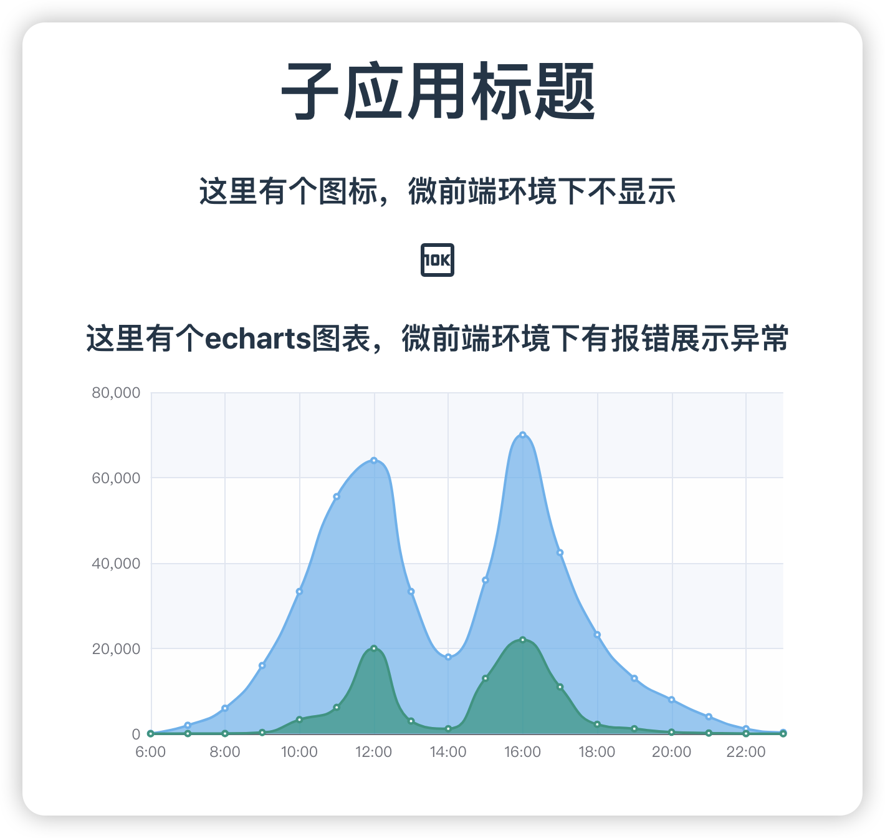
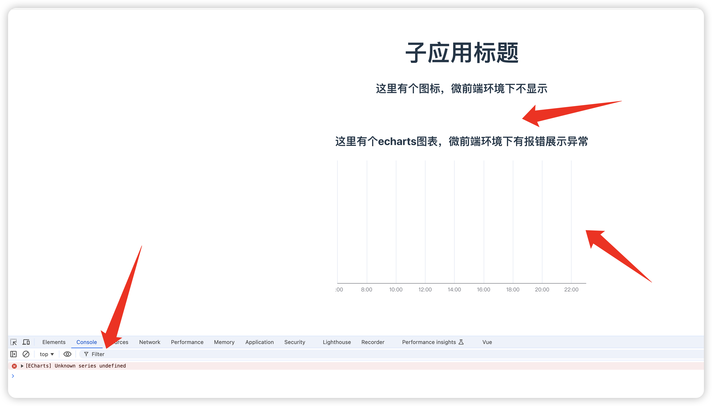

# @micro-zoe/micro-app问题复现

### 问题描述
@micro-zoe/micro-app 版本1.0.0-rc.12

子应用中：
1. echarts图标有报错 不能正常展示
2. 图标无法显示，使用@iconify/vue

### 子应用正常展示


### 子应用在微前端环境下展示如下


### 项目启动

#### 基座启动
```bash
pnpm run dev
```

#### 子应用启动
```bash
pnpm run dev-home
```